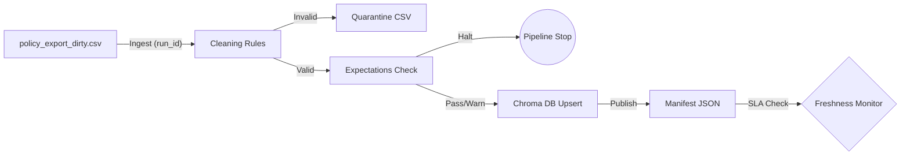

# Kiến trúc pipeline — Lab Day 10

**Nhóm:** Team 61 (E403)
**Cập nhật:** 15-04-2026

---

## 1. Sơ đồ luồng (bắt buộc có 1 diagram: Mermaid / ASCII)

> Vẽ thêm: điểm đo **freshness**, chỗ ghi **run_id**, và file **quarantine**.

---

## 2. Ranh giới trách nhiệm

| Thành phần | Input | Output | Owner nhóm |
|------------|-------|--------|--------------|
| Ingest | `policy_export_dirty.csv` | Pandas DataFrame | Member 1 (Ingestion) |
| Transform | Raw DataFrame | Cleaned CSV + Quarantine | Member 2 (Cleaning) |
| Quality | Cleaned Rows | Expectation Results (Halt/Warn) | Member 3 (Quality) |
| Embed | Validated Rows | ChromaDB Collection | Member 4 (Embed) |
| Monitor | Manifest JSON | Freshness Status / Quality Report | Member 5 (Monitoring) |

---

## 3. Idempotency & rerun

Cơ chế đảm bảo tính hội tụ (Idempotency) dựa trên:
1. **Upsert theo `chunk_id`**: `chunk_id` được tạo bằng mã hash MD5 của nội dung text. Nếu nội dung không đổi, ID không đổi, ChromaDB sẽ ghi đè thay vì tạo mới.
2. **Pruning (Dọn dẹp)**: Sau khi nạp dữ liệu, pipeline thực hiện bước `prune`. Nó so sánh danh sách ID vừa nạp với toàn bộ ID hiện có trong Chroma. Những ID cũ không còn xuất hiện trong lần chạy này sẽ bị xóa bỏ, tránh việc dữ liệu rác tích tụ.
3. **Manifest theo `run_id`**: Mỗi lần chạy tạo `manifest_<run-id>.json` để đối chiếu `raw/cleaned/quarantine` và truy vết nguồn lỗi khi expectation fail.
---

## 4. Liên hệ Day 09

Pipeline này đóng vai trò là "Data Guardrail" (rào chắn dữ liệu) cho hệ thống Multi-Agent ở Day 09. Thay vì để Agent truy cập trực tiếp vào các file text thô dễ sai sót, pipeline thực hiện:
1. **Đồng bộ Vector Database**: Dữ liệu sau khi được làm sạch và kiểm định sẽ được Upsert trực tiếp vào collection ChromaDB mà `retrieval_worker` của Day 09 sử dụng.
2. **Loại bỏ thông tin nhiễu**: Thông qua các quy tắc Cleaning (như xóa bỏ stale refund 14 days), pipeline đảm bảo Agent không bao giờ truy xuất phải các tri thức cũ/sai lệch, giúp tăng điểm Faithfulness.
3. **Chuẩn hóa Metadata**: Pipeline ép các trường `source` và `doc_id` về dạng canonical, giúp bước Synthesis ở Day 09 có thể tạo trích dẫn (citation) chính xác và nhất quán.

---

## 5. Rủi ro đã biết

1. **Freshness Lag**: Dữ liệu nguồn từ hệ thống cũ (`policy_export_dirty.csv`) có thể không được cập nhật thời gian thực, dẫn đến vi phạm SLA về độ tươi của dữ liệu (24h) như đã thấy trong báo cáo chất lượng.
2. **Phụ thuộc model cache / mạng tải model**: Lần chạy đầu cần tải `all-MiniLM-L6-v2`; nếu mạng chập chờn hoặc bị rate limit từ HF Hub thì thời gian chạy tăng.
3. **Quarantine Over-filtering**: Các quy tắc Expectation quá khắt khe có thể đẩy nhầm các bản ghi hợp lệ vào Quarantine, làm mất đi dữ liệu cần thiết cho Agent trả lời các câu hỏi đặc thù.
4. **Rủi ro Pruning**: Cơ chế xóa dữ liệu cũ (Prune) dựa trên ID có thể gây mất dữ liệu nếu logic tạo `chunk_id` (MD5 hash) gặp xung đột hoặc bị thay đổi định dạng.

