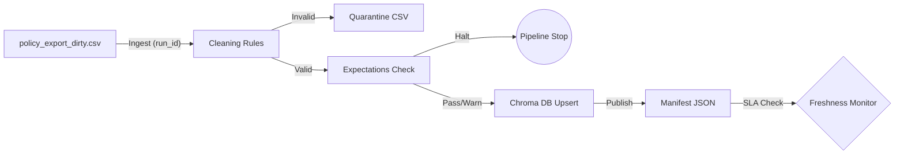

# Kiến trúc pipeline — Lab Day 10

**Nhóm:** Team 61 (E403)
**Cập nhật:** 2024-05-23

---

## 1. Sơ đồ luồng (bắt buộc có 1 diagram: Mermaid / ASCII)

> Vẽ thêm: điểm đo **freshness**, chỗ ghi **run_id**, và file **quarantine**.

---

## 2. Ranh giới trách nhiệm

| Thành phần | Input | Output | Owner nhóm |
|------------|-------|--------|--------------|
| Ingest | `policy_export_dirty.csv` | Pandas DataFrame | Member 1 (Ingestion) |
| Transform | Raw DataFrame | Cleaned CSV + Quarantine | Member 2 (Cleaning) |
| Quality | Cleaned Rows | Expectation Results (Halt/Warn) | Member 3 (Quality) |
| Embed | Validated Rows | ChromaDB Collection | Member 4 (Embed) |
| Monitor | Manifest JSON | Freshness Status / Quality Report | Member 5 (Monitoring) |

---

## 3. Idempotency & rerun

Cơ chế đảm bảo tính hội tụ (Idempotency) dựa trên:
1. **Upsert theo `chunk_id`**: `chunk_id` được tạo bằng mã hash MD5 của nội dung text. Nếu nội dung không đổi, ID không đổi, ChromaDB sẽ ghi đè thay vì tạo mới.
2. **Pruning (Dọn dẹp)**: Sau khi nạp dữ liệu, pipeline thực hiện bước `prune`. Nó so sánh danh sách ID vừa nạp với toàn bộ ID hiện có trong Chroma. Những ID cũ không còn xuất hiện trong lần chạy này sẽ bị xóa bỏ, tránh việc dữ liệu rác tích tụ.
---

## 4. Liên hệ Day 09

> Pipeline này cung cấp / làm mới corpus cho retrieval trong `day09/lab` như thế nào? (cùng `data/docs/` hay export riêng?)

---

## 5. Rủi ro đã biết

- …
